# ERD — Nền tảng Quản lý Gia sư & Lớp học trực tuyến 1-1

> Phiên bản: 1.0  
> Database: PostgreSQL  
> ID public: UUID  
> Thời gian lưu: UTC (`timestamptz`/`Instant`)  
> Tiền tệ: VND, số nguyên (`bigint`), không dùng số thực

## 1. Quy ước chung

- Các bảng nghiệp vụ thông thường có `id`, `created_at`, `updated_at`, `is_deleted` theo `BaseEntity`.
- Các bảng tài chính/audit mang tính lịch sử (`ledger_entries`, `payment_transactions`, `audit_logs`) không soft delete.
- Mọi khóa ngoại dùng UUID. Tên cột khóa ngoại theo dạng `<entity>_id`.
- Các trường enum dưới đây được lưu bằng `varchar`, không lưu ordinal.
- Dữ liệu ngân hàng lưu dạng mã hóa ở cột `account_number_encrypted`; DTO chỉ trả số đã mask.
- Quan hệ trong sơ đồ không đồng nghĩa với quyền truy cập. Ownership luôn được kiểm tra tại Service.

## 2. Sơ đồ quan hệ tổng thể

```mermaid
erDiagram
    USERS {
        uuid id PK
        varchar email UK
        varchar password_hash
        varchar full_name
        varchar avatar_url
        varchar phone
        varchar parent_full_name
        varchar parent_phone
        varchar parent_email
        boolean notify_parent
        varchar role
        varchar status
        boolean email_verified
        varchar oauth_provider
        varchar oauth_subject
        timestamptz last_login_at
    }
    REFRESH_TOKENS {
        uuid id PK
        uuid user_id FK
        varchar token_hash UK
        timestamptz expires_at
        timestamptz revoked_at
        varchar device_info
        inet ip_address
    }
    TEACHER_PROFILES {
        uuid id PK
        uuid user_id FK,UK
        text bio
        int years_of_experience
        varchar_array languages
        boolean supports_online
        boolean supports_offline
        text location_address
        varchar introduction_video_url
        varchar profile_status
        text rejection_reason
        boolean verified_badge
        boolean is_visible
        timestamptz approved_at
        uuid approved_by FK
    }
    TEACHER_DOCUMENTS {
        uuid id PK
        uuid teacher_id FK
        varchar document_type
        varchar title
        varchar cloudinary_public_id
        varchar secure_url
        varchar mime_type
        bigint file_size
        varchar verification_status
        uuid verified_by FK
        timestamptz verified_at
    }
    TEACHER_AVAILABILITIES {
        uuid id PK
        uuid teacher_id FK
        varchar day_of_week
        time start_time
        time end_time
        varchar timezone
        boolean is_active
    }
    SUBJECTS {
        uuid id PK
        varchar code UK
        varchar name
        varchar slug UK
        varchar education_level
        text description
        boolean is_active
        varchar created_source
    }
    SUBJECT_PROPOSALS {
        uuid id PK
        uuid teacher_id FK
        varchar proposed_name
        varchar education_level
        text description
        varchar status
        text review_note
        uuid reviewed_by FK
        timestamptz reviewed_at
        uuid created_subject_id FK
    }
    TEACHER_SUBJECTS {
        uuid id PK
        uuid teacher_id FK
        uuid subject_id FK
        text level_description
        text experience_description
        boolean is_active
    }
    PRICING_PACKAGES {
        uuid id PK
        uuid teacher_id FK
        uuid subject_id FK
        varchar name
        text description
        int total_sessions
        int duration_days
        bigint price_vnd
        int session_duration_minutes
        varchar status
        bigint version
    }
    INVOICES {
        uuid id PK
        varchar invoice_number UK
        uuid student_id FK
        uuid teacher_id FK
        uuid pricing_package_id FK
        bigint amount_vnd
        varchar status
        bigint payos_order_code UK
        varchar payos_payment_link_id UK
        varchar checkout_url
        text qr_code
        timestamptz payment_expired_at
        timestamptz paid_at
    }
    PAYMENT_TRANSACTIONS {
        uuid id PK
        uuid invoice_id FK
        varchar provider
        varchar provider_reference UK
        bigint order_code
        bigint amount_vnd
        timestamptz transaction_datetime
        jsonb raw_payload
        boolean signature_valid
        timestamptz processed_at
    }
    STUDENT_PACKAGES {
        uuid id PK
        uuid student_id FK
        uuid teacher_id FK
        uuid subject_id FK
        uuid pricing_package_id FK
        uuid invoice_id FK,UK
        varchar package_name_snapshot
        int total_sessions
        int remaining_sessions
        int reserved_sessions
        int completed_sessions
        int refunded_sessions
        bigint purchase_price_vnd
        numeric commission_rate
        timestamptz starts_at
        timestamptz expires_at
        varchar status
        text locked_reason
        bigint version
    }
    BOOKINGS {
        uuid id PK
        uuid teacher_id FK
        uuid student_id FK
        uuid student_package_id FK
        uuid subject_id FK
        timestamptz start_time
        timestamptz end_time
        varchar delivery_mode
        varchar meeting_link
        text location_address
        varchar status
        boolean is_trial
        boolean outside_availability_warning
        text cancel_reason
        varchar cancel_initiated_by
        timestamptz completed_at
        timestamptz cancelled_at
        timestamptz expired_at
        boolean settlement_processed
        bigint version
    }
    TRIAL_REQUESTS {
        uuid id PK
        uuid teacher_id FK
        uuid student_id FK
        uuid subject_id FK
        timestamptz preferred_start_time
        text note
        varchar status
        uuid booking_id FK,UK
        text rejection_reason
        timestamptz responded_at
    }
    SESSION_REPORTS {
        uuid id PK
        uuid booking_id FK,UK
        varchar record_link
        text content
        text feedback
        text follow_up_note
        smallint teacher_self_rating
        timestamptz submitted_at
    }
    REVIEWS {
        uuid id PK
        uuid booking_id FK,UK
        uuid student_id FK
        uuid teacher_id FK
        smallint rating
        text comment
        boolean is_visible
        uuid moderated_by FK
    }
    TEACHER_STATS {
        uuid teacher_id PK,FK
        numeric average_rating
        numeric bayesian_rating
        int review_count
        int completed_session_count
        numeric completion_rate
        int trial_session_count
        numeric trial_conversion_rate
        int global_rank
        timestamptz calculated_at
    }
    WALLETS {
        uuid id PK
        uuid teacher_id FK,UK
        bigint pending_balance_vnd
        bigint available_balance_vnd
        bigint reserved_balance_vnd
        bigint version
    }
    LEDGER_ENTRIES {
        uuid id PK
        uuid wallet_id FK
        varchar entry_type
        bigint amount_vnd
        varchar balance_bucket
        varchar direction
        varchar reference_type
        uuid reference_id
        varchar idempotency_key UK
        text description
        timestamptz created_at
    }
    TEACHER_BANK_ACCOUNTS {
        uuid id PK
        uuid teacher_id FK
        varchar bank_bin
        varchar bank_name
        text account_number_encrypted
        varchar account_holder_name
        boolean is_verified
        boolean is_default
    }
    PAYOUT_REQUESTS {
        uuid id PK
        uuid teacher_id FK
        uuid wallet_id FK
        uuid bank_account_id FK
        bigint amount_vnd
        varchar status
        text teacher_note
        text admin_note
        varchar bank_reference
        varchar proof_public_id
        varchar proof_url
        timestamptz transferred_at
        uuid processed_by FK
        timestamptz processed_at
        bigint version
    }
    REFUND_REQUESTS {
        uuid id PK
        uuid student_package_id FK
        uuid student_id FK
        text reason
        int requested_sessions
        int approved_sessions
        bigint refund_amount_vnd
        varchar status
        text admin_note
        varchar bank_name
        varchar bank_bin
        text account_number_encrypted
        varchar account_holder_name
        varchar bank_reference
        varchar proof_public_id
        varchar proof_url
        uuid processed_by FK
        timestamptz processed_at
        bigint version
    }
    PACKAGE_EXTENSION_REQUESTS {
        uuid id PK
        uuid student_package_id FK
        uuid student_id FK
        text reason
        timestamptz requested_expiry_date
        timestamptz approved_expiry_date
        varchar status
        text admin_note
        uuid reviewed_by FK
        timestamptz reviewed_at
    }
    ASSIGNMENTS {
        uuid id PK
        uuid teacher_id FK
        uuid student_id FK
        uuid subject_id FK
        varchar title
        varchar assignment_type
        jsonb content_blocks
        jsonb quiz_schema
        timestamptz due_at
        varchar status
    }
    SUBMISSIONS {
        uuid id PK
        uuid assignment_id FK
        uuid student_id FK
        jsonb content_blocks
        timestamptz submitted_at
        varchar status
        numeric score
        text feedback_text
        timestamptz graded_at
    }
    ATTACHMENTS {
        uuid id PK
        uuid owner_id FK
        varchar attachable_type
        uuid attachable_id
        varchar cloudinary_public_id
        varchar secure_url
        varchar original_filename
        varchar mime_type
        bigint file_size
    }
    CONVERSATIONS {
        uuid id PK
        uuid teacher_id FK
        uuid student_id FK
        timestamptz last_message_at
    }
    MESSAGES {
        uuid id PK
        uuid conversation_id FK
        uuid sender_id FK
        uuid client_message_id
        varchar message_type
        text content
        uuid attachment_id FK
        timestamptz sent_at
        timestamptz read_at
    }
    NOTIFICATIONS {
        uuid id PK
        uuid user_id FK
        varchar type
        varchar title
        text content
        varchar reference_type
        uuid reference_id
        boolean is_read
        timestamptz created_at
    }
    AUDIT_LOGS {
        uuid id PK
        uuid actor_id FK
        varchar action
        varchar target_type
        uuid target_id
        jsonb before_data
        jsonb after_data
        inet ip_address
        text user_agent
        timestamptz created_at
    }

    USERS ||--o{ REFRESH_TOKENS : owns
    USERS ||--o| TEACHER_PROFILES : has
    USERS ||--o{ TEACHER_PROFILES : approves
    TEACHER_PROFILES ||--o{ TEACHER_DOCUMENTS : uploads
    USERS ||--o{ TEACHER_DOCUMENTS : verifies
    TEACHER_PROFILES ||--o{ TEACHER_AVAILABILITIES : defines
    TEACHER_PROFILES ||--o{ TEACHER_SUBJECTS : teaches
    SUBJECTS ||--o{ TEACHER_SUBJECTS : assigned
    TEACHER_PROFILES ||--o{ SUBJECT_PROPOSALS : proposes
    USERS ||--o{ SUBJECT_PROPOSALS : reviews
    SUBJECTS o|--o{ SUBJECT_PROPOSALS : resolves_to
    TEACHER_PROFILES ||--o{ PRICING_PACKAGES : sells
    SUBJECTS ||--o{ PRICING_PACKAGES : for
    USERS ||--o{ INVOICES : purchases
    TEACHER_PROFILES ||--o{ INVOICES : earns_from
    PRICING_PACKAGES ||--o{ INVOICES : ordered_as
    INVOICES ||--o{ PAYMENT_TRANSACTIONS : receives
    INVOICES ||--o| STUDENT_PACKAGES : activates
    USERS ||--o{ STUDENT_PACKAGES : owns
    TEACHER_PROFILES ||--o{ STUDENT_PACKAGES : fulfills
    SUBJECTS ||--o{ STUDENT_PACKAGES : covers
    PRICING_PACKAGES ||--o{ STUDENT_PACKAGES : snapshot_of
    STUDENT_PACKAGES o|--o{ BOOKINGS : reserves
    TEACHER_PROFILES ||--o{ BOOKINGS : teaches
    USERS ||--o{ BOOKINGS : attends
    SUBJECTS ||--o{ BOOKINGS : concerns
    TEACHER_PROFILES ||--o{ TRIAL_REQUESTS : receives
    USERS ||--o{ TRIAL_REQUESTS : requests
    SUBJECTS ||--o{ TRIAL_REQUESTS : concerns
    BOOKINGS o|--o| TRIAL_REQUESTS : fulfills
    BOOKINGS ||--o| SESSION_REPORTS : produces
    BOOKINGS ||--o| REVIEWS : receives
    USERS ||--o{ REVIEWS : writes
    TEACHER_PROFILES ||--o{ REVIEWS : rated
    TEACHER_PROFILES ||--|| TEACHER_STATS : aggregates
    TEACHER_PROFILES ||--|| WALLETS : owns
    WALLETS ||--o{ LEDGER_ENTRIES : records
    TEACHER_PROFILES ||--o{ TEACHER_BANK_ACCOUNTS : owns
    TEACHER_PROFILES ||--o{ PAYOUT_REQUESTS : requests
    WALLETS ||--o{ PAYOUT_REQUESTS : funds
    TEACHER_BANK_ACCOUNTS ||--o{ PAYOUT_REQUESTS : destination
    USERS ||--o{ PAYOUT_REQUESTS : processes
    STUDENT_PACKAGES ||--o{ REFUND_REQUESTS : refunds
    USERS ||--o{ REFUND_REQUESTS : requests_or_processes
    STUDENT_PACKAGES ||--o{ PACKAGE_EXTENSION_REQUESTS : extends
    USERS ||--o{ PACKAGE_EXTENSION_REQUESTS : requests_or_reviews
    TEACHER_PROFILES ||--o{ ASSIGNMENTS : creates
    USERS ||--o{ ASSIGNMENTS : receives
    SUBJECTS ||--o{ ASSIGNMENTS : categorizes
    ASSIGNMENTS ||--o{ SUBMISSIONS : receives
    USERS ||--o{ SUBMISSIONS : submits
    USERS ||--o{ ATTACHMENTS : owns
    ATTACHMENTS o|--o{ MESSAGES : attached_to
    TEACHER_PROFILES ||--o{ CONVERSATIONS : participates
    USERS ||--o{ CONVERSATIONS : participates
    CONVERSATIONS ||--o{ MESSAGES : contains
    USERS ||--o{ MESSAGES : sends
    USERS ||--o{ NOTIFICATIONS : receives
    USERS ||--o{ AUDIT_LOGS : acts
```



## 3. Khóa, unique và check constraint

| Bảng | Ràng buộc bắt buộc |
|---|---|
| `users` | `UNIQUE(lower(email))`; `(oauth_provider, oauth_subject)` unique khi có giá trị; role `STUDENT/TEACHER/ADMIN`; `parent_full_name`, `parent_phone`, `parent_email`, `notify_parent` nullable; `notify_parent DEFAULT false` |
| `teacher_profiles` | `UNIQUE(user_id)`; user liên quan phải có role `TEACHER` |
| `teacher_availabilities` | `CHECK(start_time < end_time)`; không overlap các khoảng active của cùng teacher/ngày |
| `teacher_subjects` | `UNIQUE(teacher_id, subject_id)` |
| `pricing_packages` | `CHECK(total_sessions > 0 AND duration_days > 0 AND price_vnd > 0 AND session_duration_minutes > 0)` |
| `invoices` | unique `invoice_number`, `payos_order_code`, `payos_payment_link_id` (partial khi khác null) |
| `payment_transactions` | `UNIQUE(provider_reference)`; append-only |
| `student_packages` | `UNIQUE(invoice_id)`; mọi counter `>= 0`; tổng counter bằng `total_sessions`; `starts_at < expires_at` |
| `bookings` | `CHECK(start_time < end_time)`; trial có `student_package_id IS NULL`; booking thường có package; exclusion constraint chống overlap |
| `trial_requests` | status `PENDING/ACCEPTED/REJECTED/CANCELLED`; `booking_id` unique khi accepted; tối đa một request pending cho mỗi cặp Student–Teacher |
| `session_reports` | `UNIQUE(booking_id)` |
| `reviews` | `UNIQUE(booking_id)`; `CHECK(rating BETWEEN 1 AND 5)` |
| `wallets` | `UNIQUE(teacher_id)`; các balance `>= 0` |
| `ledger_entries` | `UNIQUE(idempotency_key)`; `amount_vnd > 0`; append-only |
| `teacher_bank_accounts` | tối đa một tài khoản default cho mỗi teacher bằng partial unique index |
| `refund_requests` | `requested_sessions > 0`; `approved_sessions >= 0`; tối đa một request đang xử lý cho mỗi package; `refund_amount_vnd = floor(approved_sessions × purchase_price_vnd / total_sessions)`, dồn phần dư vào lần duyệt cuối của cùng package |
| `package_extension_requests` | tối đa một request `PENDING` cho mỗi package |
| `conversations` | `UNIQUE(teacher_id, student_id)` |
| `messages` | `UNIQUE(sender_id, client_message_id)` để WebSocket replay không tạo tin nhắn lặp |

## 4. Ràng buộc chống trùng lịch PostgreSQL

Khoảng thời gian dùng quy ước nửa mở `[start_time, end_time)`. Hai buổi `09:00–10:00` và `10:00–11:00` không conflict.

```sql
CREATE EXTENSION IF NOT EXISTS btree_gist;

ALTER TABLE bookings
  ADD CONSTRAINT ex_booking_teacher_overlap
  EXCLUDE USING gist (
    teacher_id WITH =,
    tstzrange(start_time, end_time, '[)') WITH &&
  ) WHERE (status = 'SCHEDULED' AND is_deleted = false);

ALTER TABLE bookings
  ADD CONSTRAINT ex_booking_student_overlap
  EXCLUDE USING gist (
    student_id WITH =,
    tstzrange(start_time, end_time, '[)') WITH &&
  ) WHERE (status = 'SCHEDULED' AND is_deleted = false);
```

Availability cũng phải được kiểm tra overlap trong transaction. Có thể dùng exclusion constraint tương tự trên `(teacher_id, day_of_week, timerange)` hoặc chuẩn hóa thành bảng có `start_minute/end_minute` để GiST hoạt động ổn định.

## 5. Index đề xuất

- `users(lower(email))`, `users(role, status)`.
- `teacher_profiles(profile_status, is_visible)` và GIN cho `languages` nếu có filter.
- `teacher_subjects(subject_id, is_active, teacher_id)`.
- `pricing_packages(teacher_id, status)`, `(subject_id, status, price_vnd)`.
- `invoices(student_id, created_at DESC)`, `(status, payment_expired_at)`.
- `student_packages(student_id, status, expires_at)`, `(teacher_id, status)`.
- `bookings(teacher_id, start_time)`, `(student_id, start_time)`, `(status, end_time)`.
- `trial_requests(teacher_id, status, created_at)`, `(student_id, status, created_at)`.
- `reviews(teacher_id, is_visible, created_at DESC)`.
- `ledger_entries(wallet_id, created_at DESC)`.
- `payout_requests(status, created_at)`, `refund_requests(status, created_at)`.
- `assignments(student_id, status, due_at)`, `submissions(assignment_id, student_id)`.
- `messages(conversation_id, sent_at DESC)`, `notifications(user_id, is_read, created_at DESC)`.
- `audit_logs(actor_id, created_at DESC)`, `(target_type, target_id, created_at DESC)`.

## 6. Bất biến nghiệp vụ liên bảng

1. Teacher chỉ xuất hiện public và bán gói khi `users.status = ACTIVE`, `teacher_profiles.profile_status = APPROVED`, `is_visible = true`.
2. PricingPackage chỉ tham chiếu Subject có `teacher_subjects.is_active = true` của cùng Teacher.
3. Khi PricingPackage đã có StudentPackage, không sửa các trường snapshot: subject, giá, số buổi, thời hạn, thời lượng buổi.
4. `student_packages.total_sessions = remaining_sessions + reserved_sessions + completed_sessions + refunded_sessions`.
5. Booking chính thức phải khớp student, teacher và subject của StudentPackage; `end_time <= expires_at`.
6. Khi StudentPackage chuyển `LOCKED_EXPIRED`, các Booking `SCHEDULED` đã được tạo trước đó vẫn được giữ nguyên và diễn ra bình thường vì lượt học đã chuyển sang `reserved_sessions`; trạng thái này chỉ chặn tạo Booking mới.
7. Booking `COMPLETED` luôn có đúng một SessionReport và settlement được thực hiện idempotent.
8. Trial `SCHEDULED/COMPLETED` tối đa một bản ghi cho mỗi cặp Student–Teacher; trial không tạo ledger.
9. Review chỉ do Student của Booking `COMPLETED` tạo, mỗi Booking tối đa một review.
10. Wallet balance chỉ thay đổi cùng transaction với LedgerEntry; ledger không update/delete.
11. Payment webhook hợp lệ chỉ tạo một PaymentTransaction/StudentPackage/ledger effect dù được gửi lặp.
12. Khi đăng ký Student có ít nhất `parent_email` hoặc `parent_phone`, Service tự đặt `notify_parent = true`; phụ huynh không có role/tài khoản đăng nhập và chỉ là kênh liên hệ bị động.
13. `refund_amount_vnd = floor(approved_sessions × purchase_price_vnd / total_sessions)` theo đơn vị VND. Nếu một gói được duyệt refund nhiều lần, phần dư do làm tròn được cộng dồn vào lần duyệt cuối để tổng tiền refund khớp phần giá trị các lượt được hoàn.
14. Refund/payout/settlement lock theo thứ tự thống nhất và kiểm tra `version` để tránh lost update.

## 7. Bổ sung để khép kín đặc tả

Mục 8 có `POST /api/student/trials/requests` nhưng mục 6 chưa định nghĩa nơi lưu yêu cầu hay cách Teacher phản hồi. ERD v1 bổ sung `trial_requests` để không biến yêu cầu học thử thành dữ liệu tạm/notification không truy vết được. Khi Teacher chấp nhận, hệ thống tạo Booking `is_trial = true`, gắn `booking_id` và chuyển request sang `ACCEPTED` trong cùng transaction.

## 8. Ghi chú triển khai migration

- Tạo enum bằng `varchar + CHECK` hoặc PostgreSQL enum; dự án chọn một cách duy nhất cho toàn bộ schema.
- Dùng Flyway, không bật Hibernate `ddl-auto=update`; môi trường dev/test dùng `validate`.
- Các FK lịch sử tài chính/audit nên dùng `ON DELETE RESTRICT`; soft-delete entity nghiệp vụ thay vì xóa vật lý.
- `reference_type/reference_id` và `attachable_type/attachable_id` là polymorphic reference, phải validate ở Service vì database không tạo FK động được.
- Mọi cột `version` dùng JPA `@Version`.
